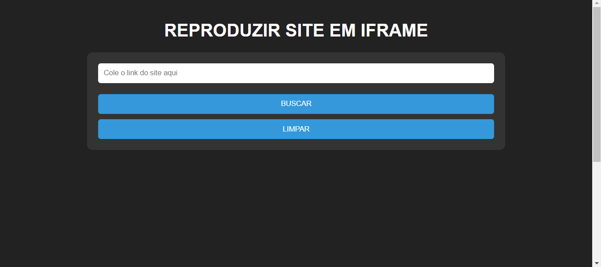

# IFRAME DE SITES
🌚VEJA SEUS SITES FAVORITOS ATRAVÉS DO IFRAME!

   
  

## DESCRIÇÃO:
Este projeto oferece uma interface simples para incorporar sites em um iframe. Aqui estão as principais funcionalidades implementadas:

1. **Incorporar Site em IFrame:**
   - Permite ao usuário inserir o link de um site no campo de entrada.
   - Ao clicar em "BUSCAR", o site é carregado dentro do iframe abaixo do formulário.

2. **Aviso de Restrição:**
   - Se o site estiver na lista de domínios bloqueados (por exemplo, "example.com", "google.com"), um aviso será exibido informando que o site não pode ser incorporado em um iframe.

3. **Limpar Formulário:**
   - Ao clicar em "LIMPAR", o campo de entrada é limpo e o iframe é resetado, removendo qualquer site carregado.

## EXECUTANDO O PROJETO:
1. **Inserir Link do Site:**
   - Cole o link do site que deseja incorporar no campo de entrada.

2. **Buscar o Site:**
   - Após inserir o link, clique em "BUSCAR" para carregar o site dentro do iframe.

3. **Aviso de Restrição:**
   - Se o site estiver na lista de domínios bloqueados, um aviso será exibido abaixo do formulário.

4. **Limpar o Formulário:**
   - Para remover o site carregado e limpar o campo de entrada, clique em "LIMPAR".

## NÃO SABE?
- Entendemos que para manipular arquivos em `HTML`, `CSS` e outras linguagens relacionadas, é necessário possuir conhecimento nessas áreas. Para auxiliar nesse aprendizado, oferecemos cursos gratuitos disponíveis:
* [CURSO DE HTML E CSS](https://github.com/VILHALVA/CURSO-DE-HTML-E-CSS)
* [CURSO DE JAVASCRIPT](https://github.com/VILHALVA/CURSO-DE-JAVASCRIPT)
* [CONFIRA MAIS CURSOS](https://github.com/VILHALVA?tab=repositories&q=+topic:CURSO)

## CREDITOS:
- [PROJETO CRIADO PELO VILHALVA](https://github.com/VILHALVA)
